# Does MOFA+ actually help with missing data in multi-omic integration?

This project set out to answer one practical question. When you are integrating transcriptomic and proteomic data and some values are missing, is MOFA+ (and its newer variants, MOFA-Flex/MOFA-Flex-GraphGP) actually a good choice for filling those gaps? Or would a plain, older imputation method do just as well or better?

Every method was tested the same way. A real value was hidden, the method guessed it, and the guess was compared against the truth. This was repeated across three real datasets, under different mixes of two reasons data goes missing in the first place. Everything below comes out of `evaluate_imputation_methods_clinical.ipynb`, the notebook that pulls together the results of the other benchmarking notebooks and produces the tables and figures shown here.

## The setup, briefly

Three matrices were tested, each with a different missing-data problem:

- **DLBCL transcriptome** (318 patients, RNA): about 4% missing, and that missingness is structural. Fourteen patients simply were not profiled for RNA at all. Nothing about a gene's expression level makes it more or less likely to be missing here.
- **DLBCL proteome** (332 patients, protein): about 34% missing, the way mass spectrometry proteomics usually is. Low-abundance proteins are disproportionately the ones that go undetected.
- **CRC proteome** (997 patients, protein): barely 0.3% missing on its own, so an artificial 30% was masked in on top of it for the test, again with a bias toward low-abundance values.

For every matrix, a mix of two kinds of artificial gaps was created: some values were hidden completely at random, and some were hidden with a bias toward the lowest values, mimicking a detection limit. The mix was swept from 0% random / 100% low-value to the reverse, in 25% steps, and repeated across five replicate runs at each setting, for 25 scenarios per matrix. Twenty-five conventional imputation methods were run against MOFA+, MOFA-Flex, and MOFA-Flex-GraphGP on every scenario. Accuracy is reported as RMSE (root mean squared error) and NRMSE (RMSE scaled by each feature's own value range, then averaged across features) on the log2-scale values all three datasets already use, so lower is better on both.

Two methods, DreamAI and ADMIN, only finished 20 of the 25 CRC scenarios. Both rely on an R package that reliably crashes on the hardest condition (every hidden value drawn from the low end of the abundance range). Their average below only reflects the easier 20, which flatters them slightly. That is called out again wherever it actually changes a conclusion.

## How every method stacks up

Fig 1 shows RMSE across all 25 scenarios, one box per method, grouped by family: general-purpose methods in blue, MNAR/left-censored substitution methods in orange, R-backed methods in aqua, deep learning in yellow, MOFA+ and MOFA-Flex in their own colors. Fig 2 shows the same thing for NRMSE, which the evaluation notebook treats as the more trustworthy ranking metric, since it is not dominated by whichever features happen to sit at the largest scale.

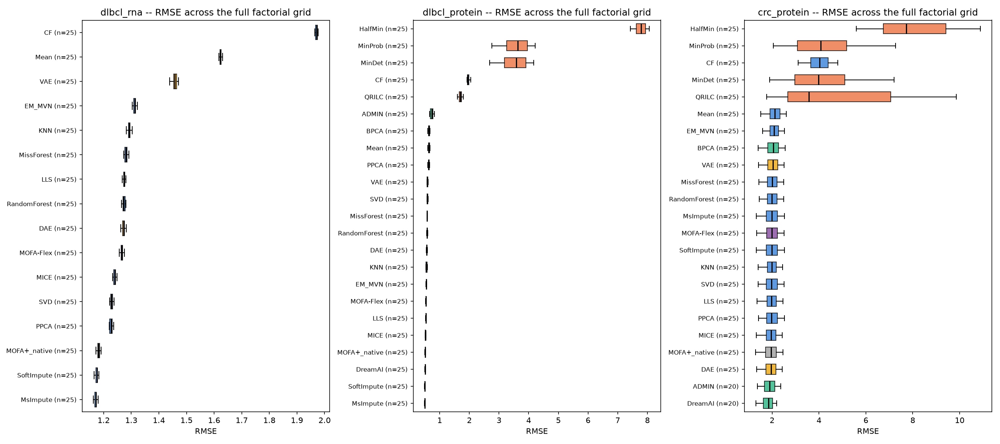

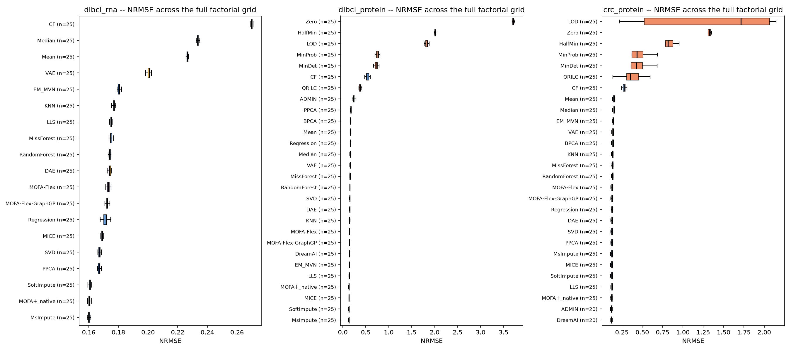

By RMSE, MOFA+ comes out on top on the DLBCL transcriptome (1.261, next best MsImpute at 1.274), fourth on the DLBCL proteome (0.563, behind MsImpute, SoftImpute, and MICE, all within 0.02 of each other), and third among fully-covered methods on CRC (1.706, behind only DreamAI and ADMIN, which had the easier partial run described above).

By NRMSE the picture is almost the same, with one small twist: on the DLBCL proteome, MICE actually edges out MsImpute and SoftImpute (0.144 versus 0.147), even though it trails both on plain RMSE. MOFA+ sits fourth by either metric there. On the transcriptome and on CRC, MOFA+ stays on top of the NRMSE ranking too, once DreamAI and ADMIN's partial CRC coverage is kept in mind.

## MOFA+ against the best conventional method

The evaluation notebook checks this two ways: against whichever conventional method is genuinely fully covered on the exact same scenarios MOFA+ ran ("scenario-matched"), and against whichever conventional method has the single lowest average RMSE anywhere in the full grid, regardless of how much of that grid it actually completed ("full grid, all masking fractions"). The two do not always agree, and the disagreement itself is informative.

| Matrix | MOFA+ RMSE | Best conventional (scenario-matched) | Wins, scenario-matched | Best conventional (full grid, unfiltered) | Wins, full grid |
|---|---|---|---|---|---|
| DLBCL transcriptome | 1.261 | MsImpute, 1.274 | Yes | MsImpute, 1.274 | Yes |
| DLBCL proteome | 0.563 | MsImpute, 0.549 | No | MsImpute, 0.549 | No |
| CRC proteome | 1.706 | DAE, 1.727 | Yes | DreamAI, 1.663 | No |

On the transcriptome, MOFA+ wins, both ways. On the proteome, it simply loses to MsImpute, both ways. On CRC, the answer flips depending on which baseline is compared to: against a method that actually finished every scenario MOFA+ did, MOFA+ wins. Against the flat minimum RMSE in the table, it loses, but only because that minimum belongs to DreamAI, which only completed 20 of the 25 scenarios and never attempted the hardest one. Whether MOFA+ "beats the best conventional method" on CRC depends on whether a method gets credit for skipping the hard part.

## Do MOFA-Flex and MOFA-Flex-GraphGP do any better?

Both were run on the full grid too, with genuine 25-of-25 coverage on every matrix. Neither beats the best conventional method on any matrix, scenario-matched or otherwise.

| Matrix | Method | RMSE | Best conventional (scenario-matched) | Wins |
|---|---|---|---|---|
| DLBCL transcriptome | MOFA-Flex | 1.365 | MsImpute, 1.274 | No |
| DLBCL transcriptome | MOFA-Flex-GraphGP | 1.357 | MsImpute, 1.274 | No |
| DLBCL proteome | MOFA-Flex | 0.586 | MsImpute, 0.549 | No |
| DLBCL proteome | MOFA-Flex-GraphGP | 0.583 | MsImpute, 0.549 | No |
| CRC proteome | MOFA-Flex | 1.749 | DAE, 1.727 | No |
| CRC proteome | MOFA-Flex-GraphGP | 1.745 | DAE, 1.727 | No |

Plain MOFA+ also beats both MOFA-Flex variants on every one of the three matrices. The gap is small in absolute RMSE, but it is consistent in direction everywhere. The most likely reason is not the model itself. MOFA+ solves for its factors directly through closed-form coordinate ascent. MOFA-Flex estimates the same kind of model through stochastic variational inference, which adds its own training noise on top of whatever the underlying model contributes. Adding the STRING protein network as a prior (MOFA-Flex-GraphGP) narrows the gap to plain MOFA-Flex slightly on two of the three matrices, but does not close it against MOFA+.

## Does it matter *why* a value went missing?

Every scenario mixes two kinds of gaps: some hidden completely at random (MCAR), some hidden with a bias toward low values (MNAR), the way real detection-limit missingness actually behaves. Fig 3 splits RMSE by which kind of gap a value came from, for the top 10 fully-covered methods on each matrix, plus MOFA+ and both MOFA-Flex variants even if they miss that top 10.

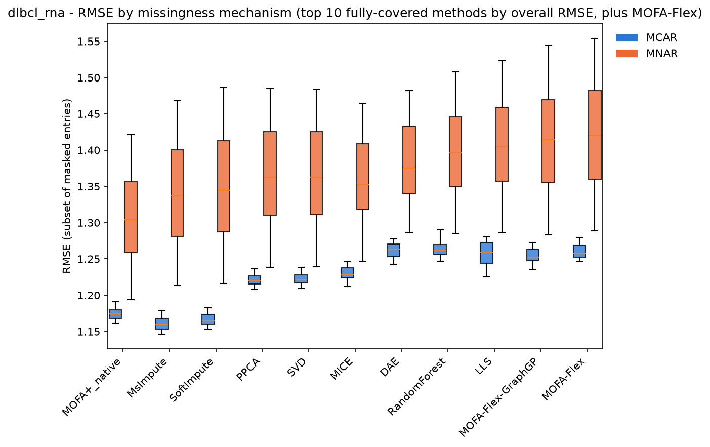

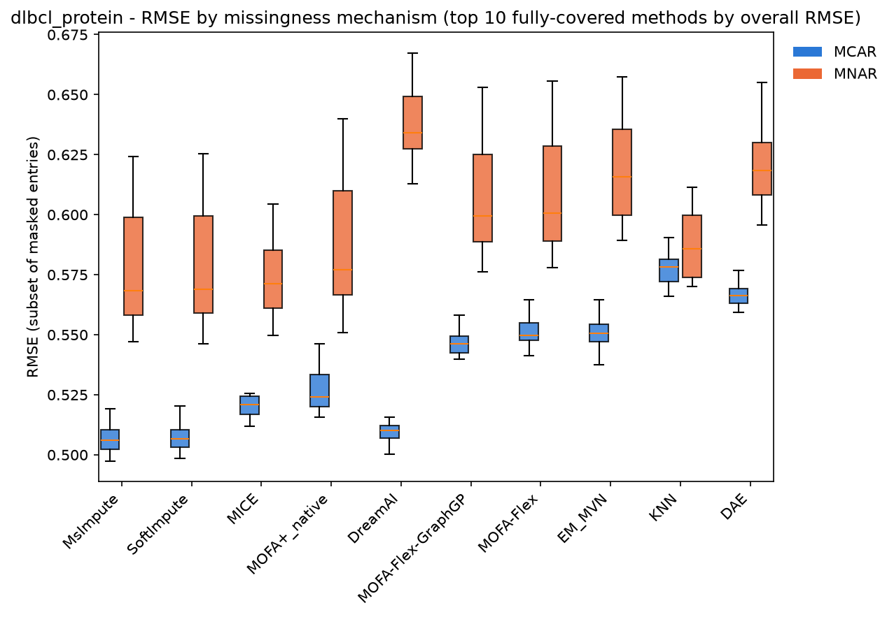

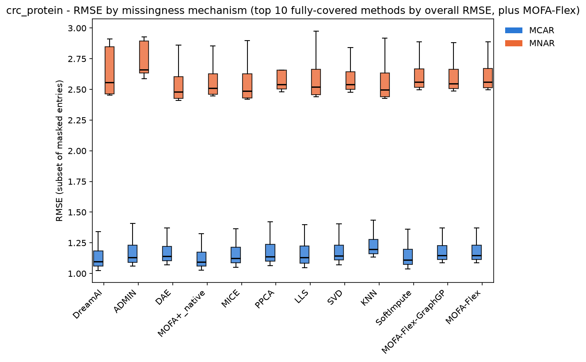

Averaged across the top methods, every one of them does worse on the MNAR-flavored gaps than the MCAR ones. MOFA+ goes from about 1.17 to 1.31 on the transcriptome, 0.53 to 0.59 on the DLBCL proteome, and 1.15 to 2.25 on CRC, nearly doubling. MOFA-Flex and MOFA-Flex-GraphGP show the same pattern, at a similar or slightly worse margin than MOFA+ on all three. This is not unique to the MOFA family. MsImpute, SoftImpute, and MICE degrade the same way, because all of them handle a missing value by leaving it out of the model fit, which only stays fair when whether a value is missing has nothing to do with what it would have been. That assumption (missing at random, in the sense Little and Rubin gave the term) is exactly what real detection-limit missingness in mass spectrometry proteomics violates. Hernández-Lobato and colleagues showed in 2014 that this kind of value-dependent missingness biases plain matrix-factorization models like these, and neither the MOFA+ nor the MOFA-Flex tests for it directly.

## Does the damage scale with how much of the masking is MNAR?

Fig 4 breaks RMSE down by masking fraction and MNAR fraction together, as a heatmap, for the top 5 fully-covered methods per matrix plus MOFA+ and MOFA-Flex.

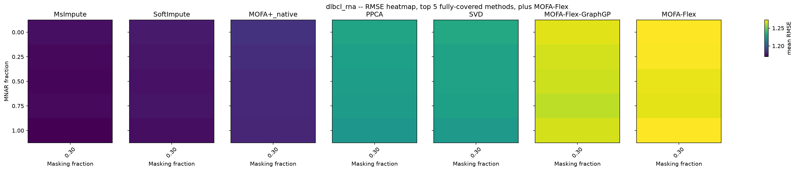

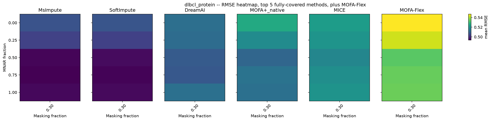

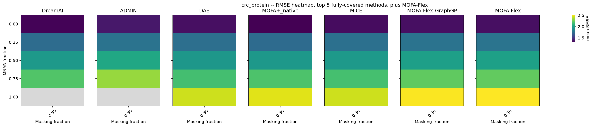

The direction matches Fig 3: error climbs as the MNAR fraction rises, for every method shown, MOFA family included. Nothing in the heatmap suggests any method here is immune to the effect. It is a matter of degree, not presence or absence.

## A consistency check: does correlation track RMSE the way it should?

Just for sanity check, a method with a better feature-centered correlation between its predictions and the truth should generally also have a lower RMSE. Fig 5 plots the two against each other, one panel per matrix, for the pilot scenario (10% masking, pure MCAR).

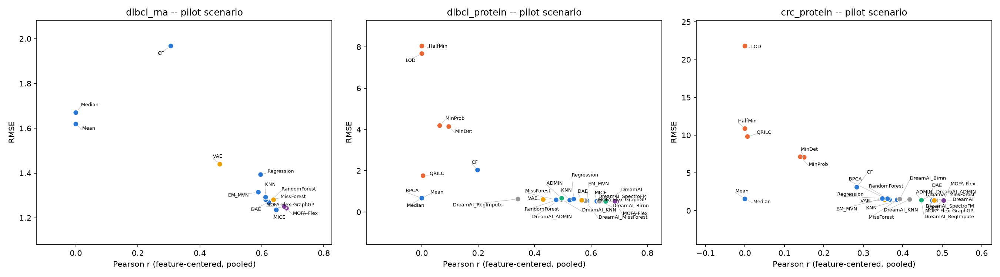

A method that lands far off the general trend in this plot would be one that tracks the right relative shape but is badly mis-scaled, or the reverse. Nothing here flags such a case among the results in hand. It is included mainly so a future re-run can be checked the same way.

## Where does the error concentrate by abundance?

Fig 6 looks at the pilot scenario, which is pure MCAR by design, and asks whether error is still concentrated at the low-abundance end even without any deliberate MNAR bias in that particular scenario. It shows mean absolute error by truth-abundance decile, for the top 6 methods on each matrix plus MOFA+ and MOFA-Flex.

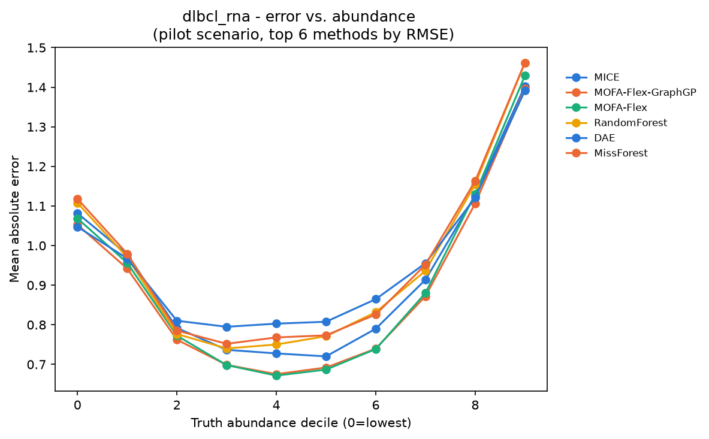

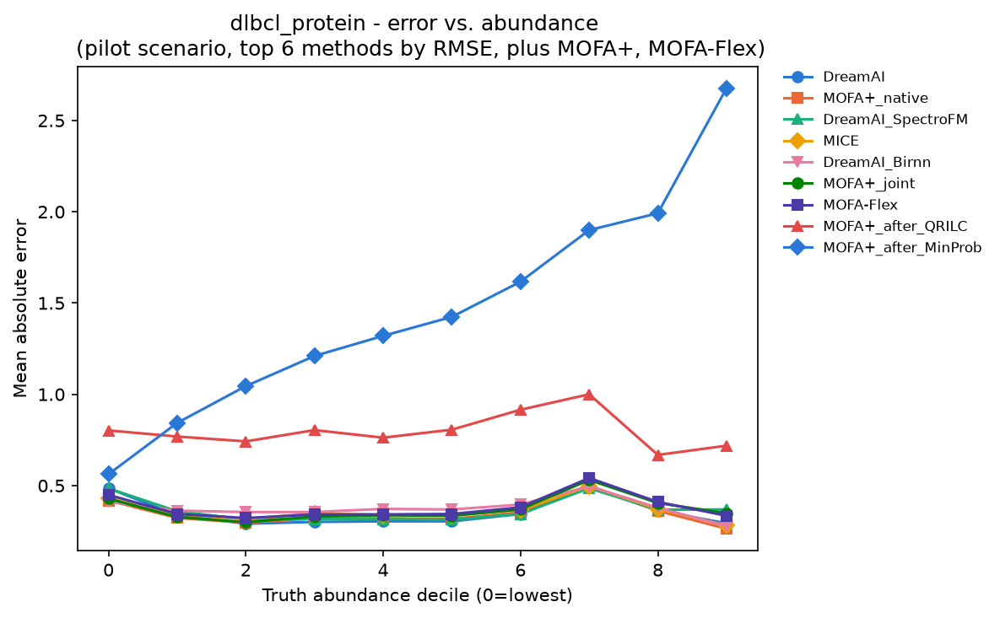

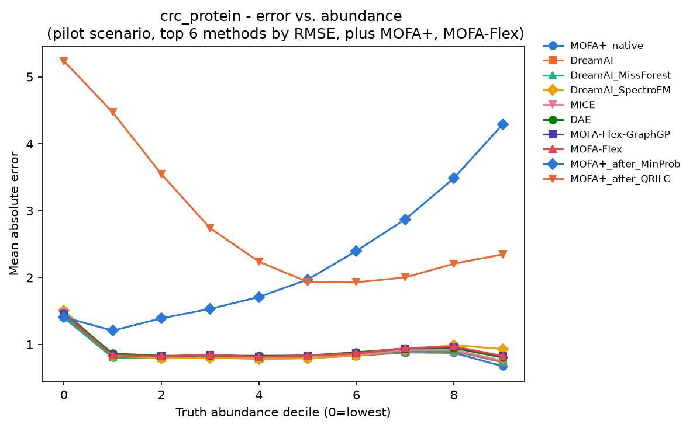

This figure is a separate, complementary check to Fig 3. Fig 3 already establishes that MNAR-flavored gaps are harder than MCAR ones. Fig 6 asks the same question from the abundance side directly, decile by decile, within a scenario where the masking itself was not abundance-biased. Read together, they point at the same underlying story: low-abundance values are the hard case, whether or not the masking mechanism in a given scenario deliberately targeted them.

## The bottom line

MOFA+ is a genuinely competitive choice for filling in missing values across this transcriptomic and proteomic data. It is the best method, or effectively tied for best, on two of the three matrices tested, and close behind on the third once DreamAI and ADMIN's partial CRC coverage is accounted for. That is a meaningfully positive result for a method whose main selling point is joint multi-omics factor modeling, not imputation on its own.

Its weak spot is real and specific. Every method tested here, MOFA+ included, loses accuracy on values that were missing because they were too faint to detect, which is the dominant pattern in real proteomics data. That comes from how these models handle missing values internally, leaving them out of the likelihood, not from an implementation flaw in this benchmark. Anyone about to run MOFA+ on detection-limit-heavy proteomics data should keep that in mind rather than trusting its native handling of gaps without such consideration.

Between the three MOFA variants tested, plain MOFA+ is currently the more accurate one for imputation specifically. MOFA-Flex and MOFA-Flex-GraphGP lose to it, and to the best conventional method, on every matrix tested here. That does not mean they are the weaker choice overall. Their real advantage is the flexibility to plug in different priors and knowledge sources, which is a different question than raw imputation accuracy, the one this benchmark was built to answer.

## Reproducing these figures

Run `benchmark_imputation_clinical.ipynb` (or the `.py` version), then `evaluate_mofaplus_multiomic_clinical.ipynb`, `evaluate_mofaflex_multiomic_clinical.ipynb`, and `evaluate_mofaflex_graphgp_multiomic_clinical.ipynb`, then `evaluate_imputation_methods_clinical.ipynb` last. 

## References

Little, R. J. A. and Rubin, D. B. *Statistical Analysis with Missing Data*.

Hernández-Lobato, J. M., Houlsby, N., and Ghahramani, Z. (2014). Probabilistic Matrix Factorization with Non-random Missing Data. *Proceedings of the 31st International Conference on Machine Learning* (PMLR/AISTATS).

Ma, W. et al. (2020). NRMSE definition and use as a cross-feature-scale-fair imputation accuracy metric, as adopted in this benchmark's evaluation notebook.

Lazar, C. et al. (2016). Accounting for the Multiple Natures of Missing Values in Label-Free Quantitative Proteomics Data Sets to Compare Imputation Strategies. *Journal of Proteome Research*, 15, 1116-1125.

Argelaguet, R. et al. (2018). Multi-Omics Factor Analysis, a framework for unsupervised integration of multi-omics data sets. *Molecular Systems Biology*, 14, e8124.

Argelaguet, R. et al. (2020). MOFA+: a statistical framework for comprehensive integration of multi-modal single-cell data. *Genome Biology*, 21, 111.

Qoku, A. et al. (2025). MOFA-FLEX: A Factor Model Framework for Integrating Omics Data with Prior Knowledge. *bioRxiv* 10.1101/2025.11.03.686250 (preprint, not yet peer reviewed).
