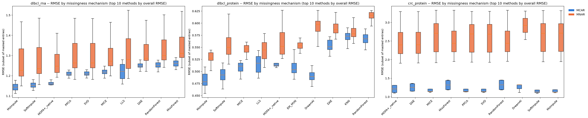

# Does MOFA+ actually help with missing data in multi-omic integration?

This project set out to answer one practical question. When you're integrating transcriptomic and proteomic data and some values are missing, is MOFA+ (and its newer variants, MOFA-Flex and MOFA-Flex-GraphGP) actually a good choice for filling those gaps? Or would a plain, older imputation method do just as well or better?

To answer that, every method was tested the same way. A known value was hidden, the method guessed it, and the guess was compared against the real number. This was repeated across three real datasets, at different amounts of missingness, and under two different reasons data goes missing in the first place. The rest of this document walks through what that testing showed and what it means for MOFA+ as a choice for imputing missing multi-omic data.

## The setup, briefly

Three matrices were tested, each with a different missing-data problem:

- **DLBCL transcriptome** (318 patients, RNA): about 4% missing, and that missingness is structural. Fourteen patients simply weren't profiled for RNA at all. Nothing about a gene's expression level makes it more or less likely to be missing here.
- **DLBCL proteome** (332 patients, protein): about 34% missing, the way mass spectrometry proteomics usually is. Low-abundance proteins are disproportionately the ones that go undetected.
- **CRC proteome** (997 patients, protein): barely 0.3% missing on its own, so an artificial 30% was masked in on top of it for the test, again with a bias toward low-abundance values.

For every matrix, a mix of two kinds of artificial gaps was created: some values were hidden completely at random, and some were hidden with a bias toward the lowest values, mimicking a detection limit. Twenty-five conventional imputation methods were run against MOFA+, MOFA-Flex, and MOFA-Flex-GraphGP, with the mix of random-versus-low-value gaps swept from 0% to 100% and repeated across five replicate runs at each setting. Accuracy is reported as RMSE (root mean squared error) on the log2-scale values every one of these datasets already uses, so lower is better and the numbers are directly comparable across methods.

## DLBCL transcriptome: MOFA+ edges out everything else, barely

| Method | RMSE | Pearson r |
|---|---|---|
| MOFA+ | 1.261 | 0.735 |
| MsImpute | 1.274 | 0.739 |
| SoftImpute | 1.282 | 0.740 |
| MICE | 1.312 | 0.713 |

MOFA+ comes out on top here, but the margin over the next-best method (MsImpute) is small enough that a paired statistical test doesn't call it a reliable difference (p = 0.055). Read this as MOFA+ holding its own against the best conventional methods, not clearly beating them.

This is also the one dataset where the missingness has no relationship to the values themselves, which is exactly the situation MOFA+'s built-in handling of missing data was designed for. That MOFA+ does well here isn't a coincidence: it lines up with what the method was actually built and validated for.

## DLBCL proteome: MOFA+ is solid but not the top pick

| Method | RMSE | Pearson r |
|---|---|---|
| MsImpute | 0.549 | 0.952 |
| SoftImpute | 0.549 | 0.953 |
| MICE | 0.550 | 0.948 |
| **MOFA+** | **0.563** | **0.949** |
| DreamAI | 0.577 | 0.948 |

Here MOFA+ lands in fourth place, and the gap to MsImpute is small in absolute terms but statistically real (p < 0.0001 across the 25 test conditions). Still, MOFA+ is well clear of the weaker methods further down the ranking, and nowhere close to the substitution-style methods described below, which fall apart on this dataset.

## CRC proteome: MOFA+ is the best method that actually finishes the job

| Method | RMSE | Scenarios completed |
|---|---|---|
| DreamAI | 1.663 | 20 of 25 |
| ADMIN | 1.691 | 20 of 25 |
| **MOFA+** | **1.706** | **25 of 25** |
| DAE | 1.727 | 25 of 25 |
| MICE | 1.729 | 25 of 25 |

DreamAI and ADMIN post lower average error, but only because they never attempted the hardest test condition, the R crash mentioned earlier. Restricted to methods that were actually scored on the full set of conditions, MOFA+ comes out ahead, and it does so with a statistically real margin over the next best fully-covered method, DAE (p < 0.0001).

## Where MOFA+ actually struggles

Across both protein datasets, splitting the score by why a value was hidden tells a clear story: every member of the MOFA family (MOFA+, MOFA-Flex, MOFA-Flex-GraphGP) does noticeably worse on values that were hidden because they were low-abundance than on values hidden completely at random. On the CRC data the error roughly doubles between the two.

This is exactly what the underlying math predicts. MOFA+ and its relatives handle a missing value by simply leaving it out of the model fit. That trick only stays fair when whether a value is missing has nothing to do with what that value would have been (this is the standard "missing at random" assumption in the statistics literature, going back to Little and Rubin). Mass spectrometry proteomics breaks that assumption directly: a protein is disproportionately likely to be missing precisely because it's low-abundance. Hernández-Lobato and colleagues showed in 2014 that this kind of value-dependent missingness biases plain matrix-factorization models exactly like MOFA+, and neither the original MOFA paper, the MOFA+ paper, nor the MOFA-Flex preprint claim otherwise or test for it directly.

It's worth being fair here, though: this weakness isn't unique to MOFA+. MICE, SoftImpute, and MsImpute show the same pattern, because they make the same missing-at-random assumption under the hood. What actually holds up under detection-limit-type missingness is a different family of methods entirely, the ones built specifically to assume a value is missing because it's low (QRILC, MinProb, MinDet, and similar). Those methods do noticeably better on the low-abundance gaps than on the random ones, the opposite pattern from MOFA+. The catch is that they only work when that assumption is actually true for every missing value. Part of the missingness in this test design is genuinely random, though. Forcing every gap toward a low-value guess is badly wrong for the ones that weren't actually low, and their overall accuracy collapses as a result (RMSE several times worse than MOFA+ or any of the general-purpose methods on both protein datasets).

## MOFA+, MOFA-Flex, and MOFA-Flex-GraphGP compared directly

MOFA-Flex is a newer, more flexible reimplementation of the same underlying model as MOFA+, built on a different training method (stochastic optimization instead of MOFA+'s exact closed-form updates). MOFA-Flex-GraphGP is the same thing again, but with a protein-protein interaction network from STRING built in as extra prior knowledge.

Comparing all three directly, with matched priors, on the same data:

MOFA+ comes out ahead of both MOFA-Flex variants on every one of the three datasets, and the difference is statistically consistent (p < 0.0001 in each case), even though the gap in absolute RMSE is fairly small. Adding the protein network (MOFA-Flex-GraphGP) narrows the gap to MOFA+ slightly compared to plain MOFA-Flex, but doesn't close it.

The most likely explanation isn't that the newer model is worse in principle. It's the training method. MOFA+ solves for the best fit directly; MOFA-Flex estimates it through repeated random sampling, which introduces its own noise on top of whatever the model itself contributes. For a study focused purely on filling in missing values as accurately as possible, that makes MOFA+ the more dependable choice of the two right now. MOFA-Flex's real advantage lies elsewhere, in the flexibility to plug in different priors and knowledge sources, which is a different question than raw imputation accuracy.

## Does pre-filling gaps first, or training on both omics layers together, help MOFA+?

Two follow-up questions came up naturally once the MNAR weakness above was clear. Would MOFA+ do better if the low-abundance-type gaps were pre-filled with a detection-limit-aware method before MOFA+ ever saw them? And would MOFA+ do better if it were trained on the RNA and protein data together instead of one layer at a time, since that's the whole point of a multi-omics factor model?

Neither idea paid off, at least in the one test scenario where both were tried directly. Pre-filling with QRILC or MinProb before handing the data to MOFA+ made the result noticeably worse, not better, on both protein datasets. Training MOFA+ jointly across RNA and protein didn't improve its accuracy on either layer compared to training on each one separately.

That second result deserves a caveat, because it's easy to read as a strike against MOFA+'s whole reason for existing. This particular test only masked values completely at random, not with the low-abundance bias real proteomics missingness actually has, and it was only run once rather than across the full range of test conditions. Whether pre-filling helps specifically under heavy, realistic detection-limit missingness, where MOFA+'s weakness above actually shows up, is still an open question and would be worth testing properly before drawing a firm conclusion either way. What can be said with the data in hand is narrower: neither trick was a free win in the condition it was actually tested in.

## The bottom line

MOFA+ is a genuinely competitive choice for filling in missing values across transcriptomic and proteomic data. It's the best or statistically tied-for-best method on two of the three datasets tested here, and never far behind on the third. That's a meaningfully positive result for a method whose main selling point is joint multi-omics factor modeling, not imputation specifically.

Its weak spot is real and specific, though. Values missing because they were too faint to detect, the dominant pattern in real proteomics data, are where MOFA+ and its relatives give up the most ground. That comes from how the model handles missing values internally, not from any implementation flaw. Anyone about to run MOFA+ on their own detection-limit-heavy proteomics data should keep that in mind, rather than leaning on its native handling of gaps without a second thought.

Between the three MOFA variants tested, plain MOFA+ is currently the more accurate one for imputation specifically. MOFA-Flex and MOFA-Flex-GraphGP trade a small amount of accuracy for more modeling flexibility, which may well be worth it for other reasons, just not for this particular question.

## Reference

Argelaguet, R. et al. (2018). Multi-Omics Factor Analysis, a framework for unsupervised integration of multi-omics data sets. *Molecular Systems Biology*, 14, e8124.

Argelaguet, R. et al. (2020). MOFA+: a statistical framework for comprehensive integration of multi-modal single-cell data. *Genome Biology*, 21, 111.

Qoku, A. et al. (2025). MOFA-FLEX: A Factor Model Framework for Integrating Omics Data with Prior Knowledge. *bioRxiv* 10.1101/2025.11.03.686250 (preprint).

Little, R. J. A. and Rubin, D. B. *Statistical Analysis with Missing Data*.

Hernández-Lobato, J. M., Houlsby, N., and Ghahramani, Z. (2014). Probabilistic Matrix Factorization with Non-random Missing Data. *Proceedings of the 31st International Conference on Machine Learning* (PMLR/AISTATS).

Lazar, C. et al. (2016). Accounting for the Multiple Natures of Missing Values in Label-Free Quantitative Proteomics Data Sets to Compare Imputation Strategies. *Journal of Proteome Research*, 15, 1116-1125.
