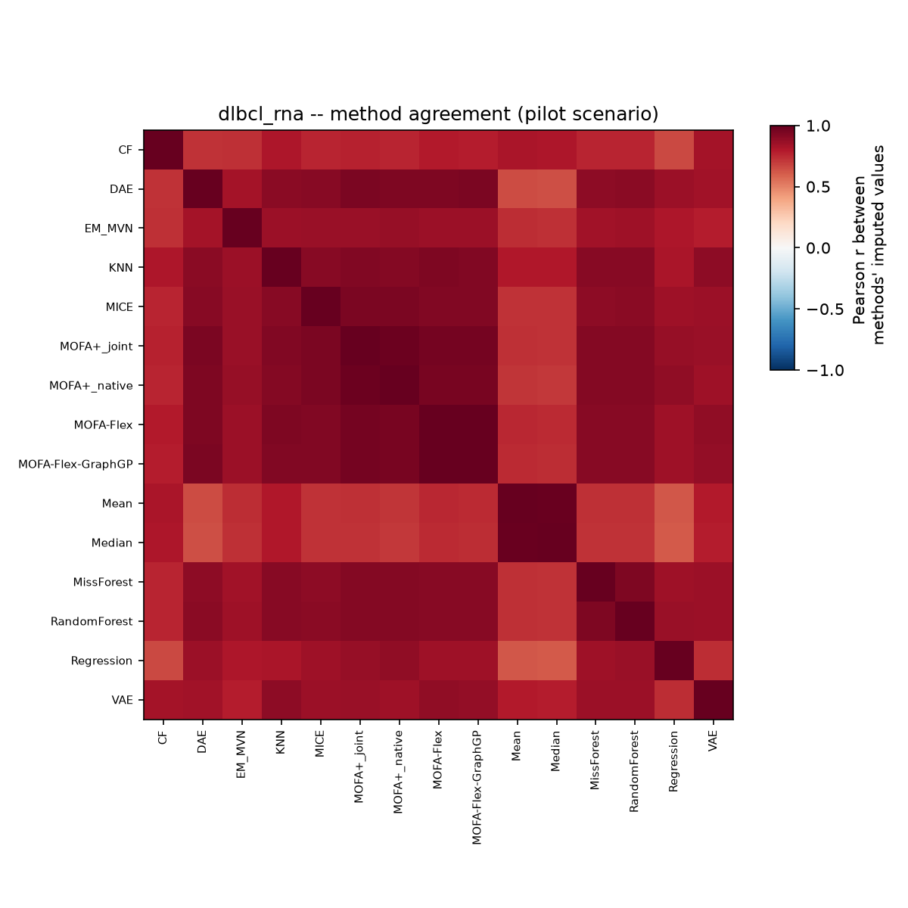
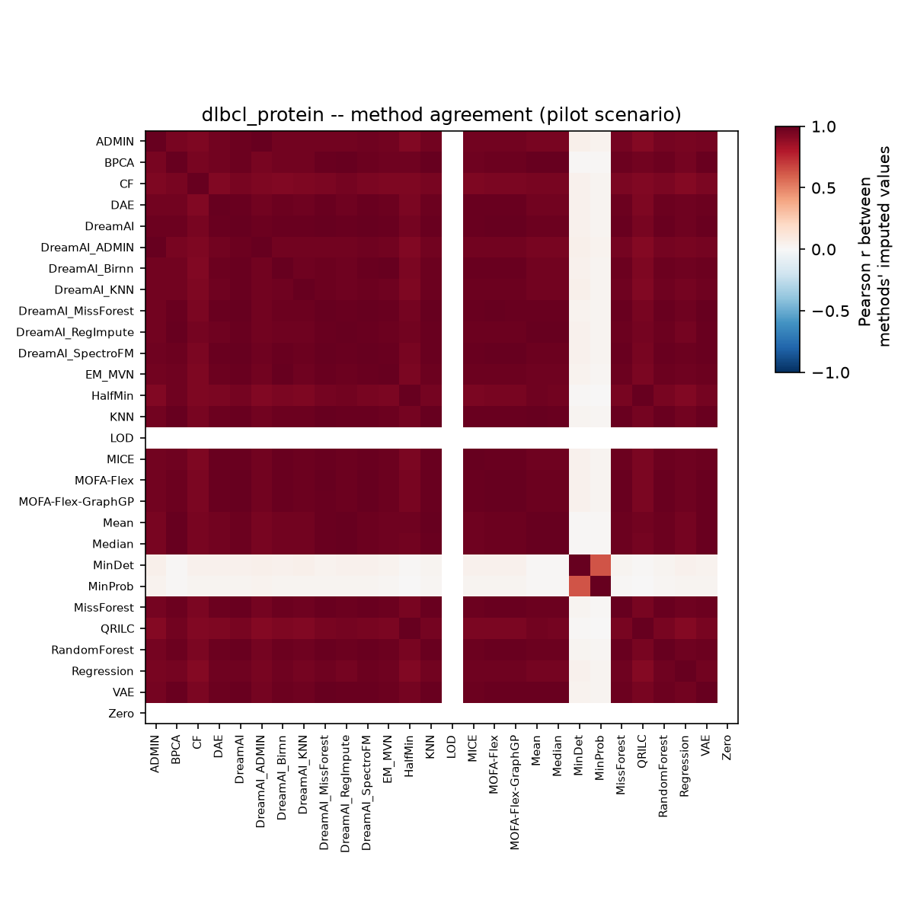
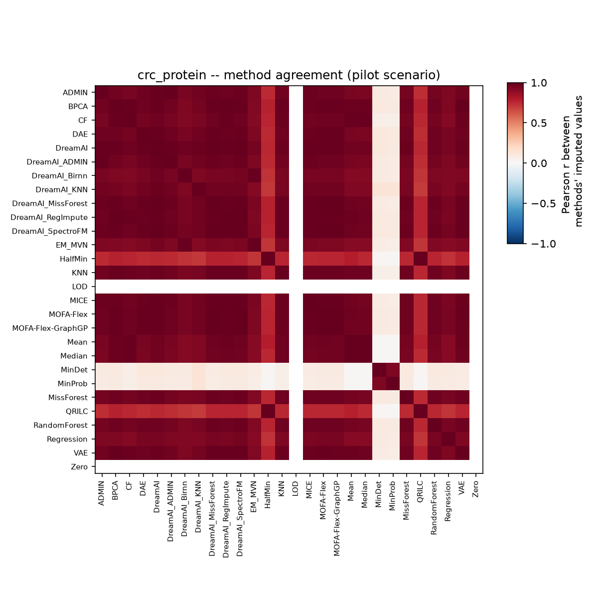

# Does MOFA+ actually help with missing data in multi-omic integration?

This project set out to answer one practical question. When you are integrating transcriptomic and proteomic data and some values are missing, is MOFA+ (and its newer variants, MOFA-Flex/MOFA-Flex-GraphGP) actually a good choice for filling those gaps? Or would a plain, older imputation method do just as well or better?

Every method was tested the same way. A real value was hidden, the method guessed it, and the guess was compared against the truth. This was repeated across three real datasets, under different mixes of two reasons data goes missing in the first place. Everything below comes out of `evaluate_imputation_methods_clinical.ipynb`, the notebook that pulls together the results of the other benchmarking notebooks and produces the tables and figures shown here.

## The setup 

Three matrices were tested, each with a different missing-data problem. All three are restricted to each dataset's 500 most-variable features (by observed-value variance) before anything else happens — a scope choice that matters here because it doesn't just shrink the matrix, it concentrates missingness: the most-variable features are disproportionately the ones already hit hardest by detection-limit dropout.

- **DLBCL transcriptome** (RNA): the full cohort is 332 patients, but 14 of them were never RNA-sequenced at all (~4% of the cohort, missing as entire patients, not as individual gene values) and are dropped before the matrix is even built — not imputed, just excluded. That leaves **318 patients**, each with a complete RNA profile, and it's this 318-patient matrix that the benchmark actually runs on. So there's **0% missing inside the matrix being tested**: One consequence: with nothing to calibrate a detection-limit curve from, this matrix's "MNAR" scenarios end up statistically indistinguishable from its MCAR ones.
- **DLBCL proteome** (332 patients, protein): **60% missing** in the 500 most-variable proteins used here — well above the ~33% missingness rate of the full ~6,900-protein panel, because the most-variable proteins are disproportionately the ones affected by detection-limit dropout. Low-abundance proteins are disproportionately the ones that go undetected.
- **CRC proteome** (997 patients, protein): **4% missing** in the 500 most-variable proteins used here (vs. ~0.3% across the full ~8,400-protein panel, same reason as above), with an artificial 30% masked in on top of that for the test, again biased toward low-abundance values.

For every matrix, a mix of two kinds of artificial gaps was created on top of whatever real missingness the matrix already had: some values hidden completely at random (MCAR), some hidden with a bias toward the lowest values, mimicking a detection limit (MNAR). The masking fraction itself was held fixed at 30%; what was swept was the *mix*, from 0% MNAR / 100% MCAR to the reverse, in 25% steps, repeated across five replicate runs at each setting — 25 scenarios per matrix. Twenty-five conventional imputation methods were run against MOFA+, MOFA-Flex, and MOFA-Flex-GraphGP on every scenario. Accuracy is reported as RMSE (root mean squared error) and NRMSE (RMSE scaled by each feature's own value range, then averaged across features) on the log2-scale values all three datasets already use, so lower is better on both.

Two methods, DreamAI and ADMIN, only finished 20 of the 25 CRC scenarios. Both rely on an R package that reliably crashes on the hardest condition (every hidden value drawn from the low end of the abundance range). Their average below only reflects the easier 20, which flatters them slightly. That is called out again wherever it actually changes a conclusion.

## How every method stacks up

Fig 1 shows RMSE across all 25 scenarios, one box per method, grouped by family: general-purpose methods in blue, MNAR/left-censored substitution methods in orange, R-backed methods in aqua, deep learning in yellow, MOFA+ and MOFA-Flex in their own colors. Fig 2 shows the same thing for NRMSE, which the evaluation notebook treats as the more trustworthy ranking metric, since it is not dominated by whichever features happen to sit at the largest scale.

By RMSE, MOFA+ is third on the DLBCL transcriptome (1.182, behind MsImpute at 1.172 and SoftImpute at 1.175 — a margin of about 0.01), fourth on the DLBCL proteome (0.517, behind MsImpute, SoftImpute, and DreamAI, all within about 0.02 of each other), and third among fully-covered methods on CRC (1.930, behind only DreamAI and ADMIN, which had the easier partial run described above).

By NRMSE the ranking shifts in MOFA+'s favor on two of the three matrices. On the transcriptome, MOFA+ (0.1605) edges ahead of SoftImpute (0.1608) into second place, though MsImpute (0.1602) still leads. On the DLBCL proteome, MOFA+ (0.1364) moves up to third, ahead of MICE (0.1365) and DreamAI (0.1440) — DreamAI's raw-RMSE edge comes from doing well on whichever features happen to sit at the largest scale, exactly the advantage NRMSE is built to remove. On CRC, the ranking doesn't change: MOFA+ stays third, behind DreamAI and ADMIN's partial coverage.

## MOFA+ against the best conventional method

The evaluation notebook checks this two ways: against whichever conventional method is genuinely fully covered on the exact same scenarios MOFA+ ran ("scenario-matched"), and against whichever conventional method has the single lowest average RMSE anywhere in the full grid, regardless of how much of that grid it actually completed ("full grid, all masking fractions"). The two do not always agree, and the disagreement itself is informative.

| Matrix | MOFA+ RMSE | Best conventional (scenario-matched) | Wins, scenario-matched | Best conventional (full grid, unfiltered) | Wins, full grid |
|---|---|---|---|---|---|
| DLBCL transcriptome | 1.182 | MsImpute, 1.172 | No | MsImpute, 1.172 | No |
| DLBCL proteome | 0.517 | MsImpute, 0.498 | No | MsImpute, 0.498 | No |
| CRC proteome | 1.930 | DAE, 1.931 | Yes | DreamAI, 1.803 | No |

On the transcriptome, MOFA+ now loses to MsImpute both ways — a reversal from an earlier run of this same benchmark, where MOFA+ had a narrow edge here. The margin is slim either way, about 0.01 RMSE. On the proteome, it simply loses to MsImpute, both ways, same conclusion as before. On CRC, the answer still depends on which baseline is used: against a method that actually finished every scenario MOFA+ did (DAE), MOFA+ wins, but only by about 0.0004 RMSE — essentially a tie. Against the flat minimum RMSE in the table, it loses, but only because that minimum belongs to DreamAI, which only completed 20 of the 25 scenarios and never attempted the hardest one. Whether MOFA+ "beats the best conventional method" on CRC still depends on whether a method gets credit for skipping the hard part.

## Do MOFA-Flex and MOFA-Flex-GraphGP do any better?

Both were run on the full grid too, with genuine 25-of-25 coverage on every matrix. Neither beats the best conventional method on any matrix, scenario-matched or otherwise.

| Matrix | Method | RMSE | Best conventional (scenario-matched) | Wins |
|---|---|---|---|---|
| DLBCL transcriptome | MOFA-Flex | 1.271 | MsImpute, 1.172 | No |
| DLBCL transcriptome | MOFA-Flex-GraphGP | 1.266 | MsImpute, 1.172 | No |
| DLBCL proteome | MOFA-Flex | 0.542 | MsImpute, 0.498 | No |
| DLBCL proteome | MOFA-Flex-GraphGP | 0.539 | MsImpute, 0.498 | No |
| CRC proteome | MOFA-Flex | 1.978 | DAE, 1.931 | No |
| CRC proteome | MOFA-Flex-GraphGP | 1.972 | DAE, 1.931 | No |

Plain MOFA+ also beats both MOFA-Flex variants on every one of the three matrices. The gap is small in absolute RMSE, but it is consistent in direction everywhere. The most likely reason is not the model itself. MOFA+ solves for its factors directly through closed-form coordinate ascent. MOFA-Flex estimates the same kind of model through stochastic variational inference, which adds its own training noise on top of whatever the underlying model contributes. Adding the STRING protein network as a prior (MOFA-Flex-GraphGP) narrows the gap to plain MOFA-Flex on all three matrices now, though it still doesn't close the gap against MOFA+ on any of them.

## Does it matter *why* a value went missing?

Every scenario mixes two kinds of gaps: some hidden completely at random (MCAR), some hidden with a bias toward low values (MNAR), the way real detection-limit missingness actually behaves. Fig 3 splits RMSE by which kind of gap a value came from, for the top 10 fully-covered methods on each matrix, plus MOFA+ and both MOFA-Flex variants even if they miss that top 10.

On CRC proteome, every method gets substantially worse on MNAR gaps, MOFA+ included: its RMSE goes from about 1.13 on the MCAR subset to about 2.59 on the MNAR subset, more than doubling. MOFA-Flex and MOFA-Flex-GraphGP show the same pattern, at a similar margin. MsImpute, SoftImpute, and MICE degrade the same way. All of these handle a missing value by leaving it out of the model fit, which only stays fair when whether a value is missing has nothing to do with what it would have been — the assumption (missing at random, in the sense Little and Rubin gave the term) that real detection-limit missingness violates. Hernández-Lobato and colleagues showed in 2014 that this kind of value-dependent missingness biases plain matrix-factorization models like these, and neither MOFA+ nor MOFA-Flex tests for it directly.

On the DLBCL proteome, the same methods do the opposite: MOFA+'s RMSE actually improves slightly on the MNAR subset (about 0.52 versus 0.51), and so does every other method tested there. This isn't evidence that MNAR missingness is secretly easy in mass spec proteomics — it's a consequence of this matrix already being ~60% missing for real, detection-limit reasons, before any synthetic masking happens. The truly lowest, hardest values are already `NaN` and excluded from the pool this benchmark draws synthetic MNAR gaps from, so the synthetic MNAR subset here is only mildly shifted toward low values but is also markedly less variable than the MCAR subset. Lower target variance mechanically caps how large RMSE can get, and that effect outweighs the "low values are harder" effect on this matrix. Real detection-limit censoring already removed the entries that would have made this task hard.

On the DLBCL transcriptome, there's effectively no difference between the MCAR and MNAR subsets for any method (MOFA+: 1.182 vs 1.181). That's expected, not a finding: this matrix has 0% real missingness once restricted to profiled patients, so the notebook's own MNAR-curve calibration has nothing to fit and falls back to an uninformative, MCAR-like weighting. The "MNAR" scenarios on this matrix are, statistically, just more MCAR scenarios.

Altogether, the "MNAR is harder" story is real, but only demonstrated on CRC. It reverses on the DLBCL proteome specifically because that matrix's real missingness has already stripped out the entries that would make the effect show up, and it's untested on the transcriptome because that matrix has no real missingness left to calibrate an MNAR curve from. Whether a benchmark like this one detects the MNAR penalty at all depends heavily on how much real detection-limit censoring the input data already had.

## Does the damage scale with how much of the masking is MNAR?

Fig 4 breaks RMSE down by masking fraction and MNAR fraction together, as a heatmap, for the top 5 fully-covered methods per matrix plus MOFA+ and MOFA-Flex. The masking fraction itself is fixed at 30% throughout this benchmark (see "The setup," above), so each heatmap really shows a profile across the five MNAR-fraction settings rather than a full two-way grid.

The pattern tracks Fig 3, matrix by matrix, rather than holding uniformly. On CRC, error climbs steadily as the MNAR fraction rises, for every method shown, MOFA family included — RMSE for MOFA+_native goes from 1.31 at 0% MNAR to 2.47 at 100% MNAR, for example. On the DLBCL proteome, the trend runs the other way: RMSE for the same methods drifts down as the MNAR fraction increases (MOFA+_native: 0.53 at 0% MNAR to 0.51 at 100%), for the reason given above — this matrix's own real missingness has already removed the hardest low-abundance entries from what's left to mask. On the DLBCL transcriptome, RMSE barely moves across the MNAR-fraction sweep at all, consistent with there being no real MNAR signal to calibrate against in that matrix. Whether "more MNAR masking means more damage" depends entirely on how much real detection-limit censoring the underlying matrix already had — it is not a universal property of these methods, or of MNAR missingness in general.

## A consistency check: does correlation track RMSE the way it should?

Just for sanity check, a method with a better feature-centered correlation between its predictions and the truth should generally also have a lower RMSE. Fig 5 plots the two against each other, one panel per matrix, for the pilot scenario (30% masking, pure MCAR).

A method that lands far off the general trend in this plot would be one that tracks the right relative shape but is badly mis-scaled, or the reverse. Nothing here flags such a case among the results in hand. It is included mainly so a future re-run can be checked the same way.

## Where does the error concentrate by abundance?

Fig 6 looks at the pilot scenario, which is pure MCAR by design, and asks whether error is still concentrated at the low-abundance end even without any deliberate MNAR bias in that particular scenario. It shows mean absolute error by truth-abundance decile, for the top 6 methods on each matrix plus MOFA+ and MOFA-Flex.

This figure is a separate, complementary check to Fig 3. Fig 3 shows the size of the MNAR penalty is matrix-dependent, not universal. Fig 6 asks a related but separate question: even under pure MCAR masking, does error still concentrate at the low-abundance end? For both protein matrices, yes — the lowest-abundance decile has by far the largest mean absolute error of any decile (DLBCL protein: 0.42 vs. ~0.30-0.35 in the middle deciles; CRC: 1.40 vs. ~0.68-0.88 elsewhere). For the transcriptome, no: error is elevated at both ends of the abundance range, not just the low end, consistent with there being no detection-limit-style link between abundance and missingness in RNA to begin with. So low-abundance values being harder to impute is a real pattern specific to the two proteomic matrices here — it doesn't depend on whether a given scenario's masking was deliberately biased toward them, but it isn't a universal property of every matrix tested.

## Which methods agree with each other?

Fig 7 looks at how similar different methods' own imputed values are to each other on the same masked entries, in the pilot scenario — a pairwise Pearson correlation between every pair of methods' guesses, not against the truth. This shows which methods behave like near-duplicates and which are doing something genuinely different, independent of which one happens to be more accurate.

The clearest pattern: every MOFA+ variant correlates almost perfectly with every other MOFA+ variant (MOFA+_native vs. MOFA+_joint: r=0.979 on the transcriptome, r=0.994 on the proteome) — unsurprising, since they share the same underlying factor model and differ only in how missing values are handled going in. MOFA+_native's least similar method on both protein matrices is MinProb (r=0.03 on DLBCL protein, r=0.09 on CRC), a left-censored substitution method that guesses low values almost regardless of context — about as different an imputation strategy from a joint factor model as this benchmark contains. On CRC, MOFA+_native's closest non-MOFA+ neighbor is DreamAI_MissForest (r=0.993), despite the two using unrelated approaches.

## Conclusion 

MOFA+ is competitive, but not a standout, choice for filling in missing values across this transcriptomic and proteomic datasets. Across all three matrices, it lands third or fourth by RMSE among fully-covered methods (second or third by NRMSE), consistently within a few percent of MsImpute and SoftImpute, the two methods that lead almost every ranking here. It essentially ties the best conventional method on CRC (a margin of 0.0004 RMSE against DAE), and loses narrowly to MsImpute on both DLBCL matrices, including the transcriptome. That's a reasonable result for a method whose main selling point is joint multi-omics factor modeling, not imputation on its own.

Its weak spot is real, but conditional rather than universal. On CRC — the one matrix here with almost no real, pre-existing detection-limit censoring — MOFA+ (and every other method tested) loses substantial accuracy on values that were missing because they were too faint to detect: RMSE roughly doubles from the MCAR subset to the MNAR one. On the DLBCL proteome, which already carries ~60% real detection-limit missingness before this benchmark starts, the same methods do slightly better on the MNAR-flavored subset instead, because the real censoring has already stripped out the hardest, most extreme low values from what's left to test against. So the practical risk isn't "MOFA+ mishandles detection-limit missingness" in the abstract — it's that a method's measured robustness to MNAR gaps depends on how much real censoring the data already has, and can look artificially reassuring on data that's already heavily pre-censored. Anyone evaluating MOFA+ (or any of these methods) on their own proteomics data should check where it sits on that spectrum before trusting a benchmark result like this one at face value.

Between the three MOFA variants tested, plain MOFA+ is still the more accurate one for imputation specifically. MOFA-Flex and MOFA-Flex-GraphGP lose to it, and to the best conventional method, on every matrix tested here. That does not mean they are the weaker choice overall. Their real advantage is the flexibility to plug in different priors and knowledge sources, which is a different question than raw imputation accuracy, the one this benchmark was built to answer.

## Reproducing these figures

Run `benchmark_imputation_clinical.ipynb` (or the `.py` version — the two are kept in sync), then `evaluate_mofaplus_multiomic_clinical.ipynb`, `evaluate_mofaflex_multiomic_clinical.ipynb`, and `evaluate_mofaflex_graphgp_multiomic_clinical.ipynb`, then `evaluate_imputation_methods_clinical.ipynb` last.

## References

Little, R. J. A. and Rubin, D. B. *Statistical Analysis with Missing Data*.

Hernández-Lobato, J. M., Houlsby, N., and Ghahramani, Z. (2014). Probabilistic Matrix Factorization with Non-random Missing Data. *Proceedings of the 31st International Conference on Machine Learning* (PMLR/AISTATS).

Ma, W. et al. (2020). NRMSE definition and use as a cross-feature-scale-fair imputation accuracy metric, as adopted in this benchmark's evaluation notebook.

Lazar, C. et al. (2016). Accounting for the Multiple Natures of Missing Values in Label-Free Quantitative Proteomics Data Sets to Compare Imputation Strategies. *Journal of Proteome Research*, 15, 1116-1125.

Argelaguet, R. et al. (2018). Multi-Omics Factor Analysis, a framework for unsupervised integration of multi-omics data sets. *Molecular Systems Biology*, 14, e8124.

Argelaguet, R. et al. (2020). MOFA+: a statistical framework for comprehensive integration of multi-modal single-cell data. *Genome Biology*, 21, 111.

Qoku, A. et al. (2025). MOFA-FLEX: A Factor Model Framework for Integrating Omics Data with Prior Knowledge. *bioRxiv* 10.1101/2025.11.03.686250 (preprint, not yet peer reviewed).
